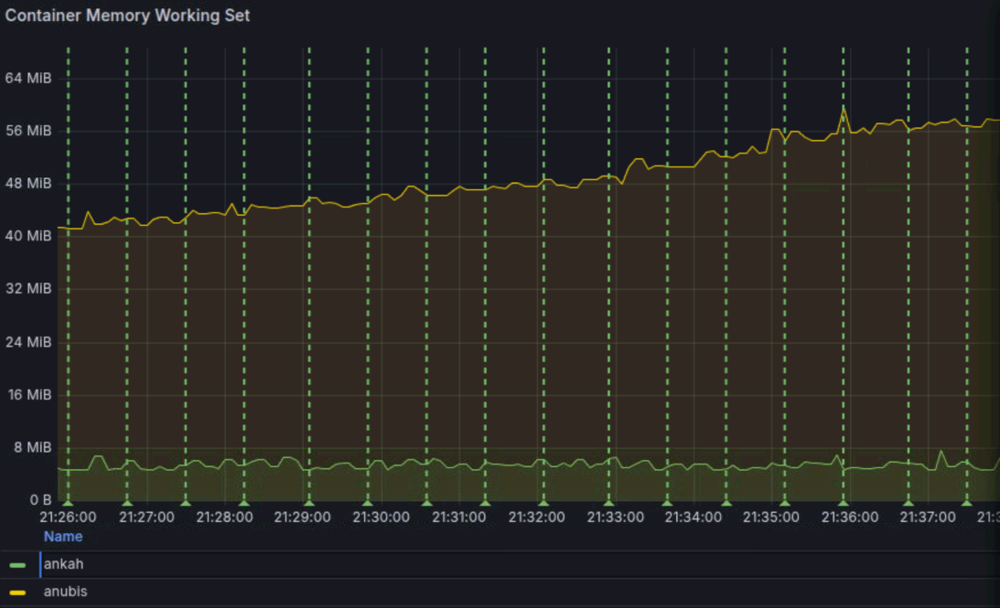
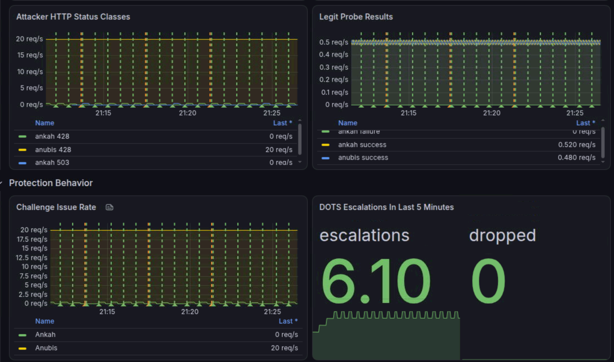

# Ankah -- **A**utomatic.[NAC](https://www.cisco.com/site/us/en/learn/topics/security/what-is-network-access-control-nac.html).**K**eeping.**A**vailability.**H**igh


Ankah is an internet shield. It was all started because some python django websites
were being rate limited down to oblivion to the point that normal users couldn't
even reliably connect anymore.

A solution had to be found, but existing projects were too much work for too little
gain. Now Ankah protects your site from becoming overloaded by bots. It can be used
equally well by those who run a VPS, and those who are using docker containers.

The mascot image can be overriden easily by changing a single .png on disk or in
the Docker image. By default, you can also change the mascot image live at runtime
without restarting so long as you configure bearer token security or a [TOTP](https://en.wikipedia.org/wiki/Time-based_one-time_password) key.

This open-source lightweight web firewall will protect small websites and servers
from aggressive AI scraper bots and automated traffic overload. It can also help
a python web app have its static files (like CSS, JavaScript, and images) served
directly in production without needing a separate web server configuration like
Nginx or an external storage service like Amazon S3.

  - It supports a [synology-DSM](https://kb.synology.com/en-global/DSM/help/DSM/AdminCenter/system_login_portal_advanced) style TLS terminating reverse proxy (no complex
    reverse proxy routing/nginx config is required unlike other solutions).
  - Trusted proxy networks are explicit and forwarded headers are rebuilt safely.
  - Static files are packaged at build time and served before Daphne / Gunicorn etc,
    so [WhiteNoise](https://pypi.org/project/whitenoise/) is unnecessary at runtime.
  - Django [collectstatic](https://docs.djangoproject.com/en/6.1/ref/contrib/staticfiles/) output is supported.
  - Upload limits, body timeouts, graceful docker shutdown, [health routes](https://kubernetes.io/docs/reference/using-api/health-checks/),
    [metrics](https://grafana.com/docs/grafana/latest/fundamentals/intro-to-prometheus/), and static caching are covered.
  - A full test suite (python 3.12 scripts and docker with caddy) with [git CI](https://docs.github.com/en/actions/get-started/continuous-integration)
  - Correctly gates curl/wget (using cli compatible proof of work responses, so
    that admins won't need to open a browser). Other solutions either block curl
    completely,	or allow runaway scripts and cli agents to overload their servers
    and bring them down. This feature is currently unique to Ankah.
  - It forwards the startup and shutdown of the wrapped script / process. So
    docker shutdown travels through Ankah connection draining, then to the wrapped
    script. And a script / process crash bubbles up through Ankah to then arrive at
    the Docker reporting and control layer, where you can manage it like normal.
  - Supports DOTS (Distributed Denial-of-Service Open Threat Signaling) data-channel
    filtering [RFC 8783](https://www.rfc-editor.org/rfc/rfc8783.html), which lets an upstream filtering point block repeat flooders before
    they reach your server. See [DOTS data-channel filtering](docs/dots.md) and the
    [worked example](examples/dots-benchmark/README.md).
  - The mascot image can be customised with a single Dockerfile line when deploying.

Ankah's low RAM usage is beneficial for those hosting on low end boxes, the kind of
hardware which is most affected by AI scanners, bot floods, and automated spam scripts.

<small>Ankah's system memory usage is small and bounded, staying constant throughout this memory test, whereas Anubis memory usage climbed to over 10x higher under the same test load scenario</small>

You can run the included docker compose DOTS demo to test ankah vs anubis protecting
an application server under equal round robin load testing on the same HW.

<small>Ankah successfully offloading bot attacks to the DOTS appliance, allowing its challenge rate to fall to 0, proving that no bot connections are even reaching the app server anymore. Meanwhile, legitimate users (represented by legit probe results) are able to make it through the flood attack and successfully reach the application server at a greater frequency.</small>

## Why this is important
Bots making your site slow and causing timeouts hurts normal users, crawlers, APIs, SEO,
accessibility, and conversion.

Proof of work client side cryptographic hash challenges are the current recommended
best practice solution to this issue. By default ankah allows good crawlers from known
address and challenges everything else. If a bot is especially persistent at trying to
flood your website while ignoring challenges, Ankah will even block it in the default
configuration.

Ankah is product neutral. It works just as well in front of nodejs as it does python.

## SEO is fully supported
Both google and bing crawlers are allowed through by default. However both are rate
limited so that your application server will only ever see 1 crawler page load at
a time, no matter who they are from or how many requests they try to send at once.

This means that crawlers cannot slow your site down so long as your site is able to
handle at least 2 people using it at once, and with this you will still get full
search rankings like always.

The SEO-boosting crawler proof-of-work gate bypass cannot become a source of DDoS
itself because it is heavily rate limited with at most 1 concurrent RDNS query in
flight at once, with full asynchronous socket scheduling and normal timeouts.

## Quick download
- Linux x64 (musl): [download the latest package](https://github.com/jamosdev/ankah/releases/latest/download/ankah-linux-musl-x64.tar.gz)
- macOS arm64: [download the latest package](https://github.com/jamosdev/ankah/releases/latest/download/ankah-macos-arm64.tar.gz)
- Windows x64: [download the latest package](https://github.com/jamosdev/ankah/releases/latest/download/ankah-windows-x64.zip)
- [Browse GitHub releases](https://github.com/jamosdev/ankah/releases) or [GitLab releases](https://gitlab.101174.xyz/public-releases/ankah/-/releases/permalink/latest).

Choose a version and verify its archive against that host's `SHA256SUMS`.
Keep the `assets` directory from the archive and pass its path with
`--assets-dir`. See [release packages](docs/release-packages.md) for a Dockerfile
that downloads a binary without compiling Ankah.
The Linux and macOS links become available with the first versioned release.


## Synopsis
The gateway accepts HTTP/1.1 and can negotiate HTTP/2 over its optional TLS
listener and HTTP/3 over QUIC on the same port. It forwards requests to a
local application server over HTTP/1.1.
It can start that server as a child process. The browser challenge can be
solved on the original device or by scanning a QR code with a phone. A browser
without JavaScript shows the QR code immediately; a browser that is stuck (still
solving after ten seconds) shows it too. The phone marks the original browser
session as solved, then the original browser uses its Finished button to
continue. A Python based terminal solver is available through a Bash/CMD script.
The gateway supports conditional requests and serves assets at paths containing
their SHA-256 digest with `Cache-Control: public, max-age=31536000, immutable`.
Challenge pages and scripts use `Cache-Control: no-store`.

The browser normally searches for an answer in a single WebAssembly worker.
If the worker or module cannot start, it falls back to the Web Crypto solver.
Both use the same challenge and answer endpoint. The QR option remains
available on the original page.

> Ankah Core is licensed under the GNU Lesser General Public License,
> version 3 or any later version. See [LICENSE](LICENSE)
>
> Ankah Core consists of the Ankah source files and public interfaces
> identified as core in the source tree and build system. Modifications
> to Ankah Core remain subject to the LGPL.
>
> Independent integration modules that use Ankah's documented integration
> interfaces may be distributed under terms chosen by their authors,
> including proprietary terms. Such modules are not part of Ankah Core
> and are not bound by the LGPL (unless they copied Ankah Core code).


Protocol upgrade requests require an existing solved browser session or pass.
Clients should complete an ordinary GET challenge before opening a WebSocket.
Requests sent upstream receive canonical forwarding headers derived from the
configured public origin and the resolved client address. Forwarded client
addresses can be accepted from explicitly configured proxy networks.

For a blocked GET, `Finished` redirects to the exact original path and query.
For a blocked POST, Ankah holds the original headers and raw body in process
memory and the page carries a one-use continuation token. The token form
submits to the original path; Ankah replaces that form with the saved request
before forwarding it. This preserves multipart boundaries and binary form
parts. The phone never receives the browser session cookie or saved request.

Saved POST bodies are limited to 2 MiB each and 64 MiB for the server in total.
**This only affects the case where an unrecognized POST method arrives from a
user who hasn't completed the proof of work challenge, and gets greeted with
the challenge page to prove themselves while Ankah holds onto their submitted
data before forwarding the original POST to the destination web application
once they successfully verify**. No files are spooled to disk.
This will almost never happen to a normal user because how could someone even
get to the point of uploading a file (or posting a form) without having to have
loaded the website (and get challenged) to begin with? If the POST data is
abandoned then an unsolved session expires after five minutes, a solved but
unsent session after thirty. Normal posts go straight through in a streaming
manner and never enter into these buffer limits.

A process restart clears sessions and saved requests. A blocked POST larger
than 2 MiB, or a blocked request with a method other than GET or POST, is refused
with a link to the unlock page: a browser that accepts HTML gets a small page with
an Unlock link, curl and Wget get the terminal solver instructions, and other
clients get the link as text. The link returns to the page named by a
same-origin `Referer`, or to `/`.

`GET /ankah/unlock` always issues a fresh challenge, even to a client that has
already passed one, and never reaches the application. After Finished it
redirects to `/`, or to the path given as `?return=<path>`. The return path is
used exactly as written, without percent decoding, and must be a local path
starting with a single `/`. Visiting the page replaces the browser session
cookie, so a browser that was already allowed must solve the new challenge
before continuing. `/ankah/unlock?return=/ankah/unlock` repeats the proof of
work on every visit, which is useful for testing the solvers.

Ankah can also serve packaged application static files directly. The build
helper detects common Python web app and frontend directories, then writes a
content addressed bundle for Ankah to load at startup. See
[build time static serving](docs/static-serving.md).
The builder also stores gzip and Brotli variants. Static responses support
single and multipart byte ranges, and a bounded memory cache retains hot
compressed files. Selected static prefixes can require proof of work and share
global and per-client connection and bandwidth limits, with a no-script browser
queue.

## Build and test

Requires C99 and C++17 compilers, CMake, libuv, Mbed TLS, nghttp2, Python 3,
and Clang with a WebAssembly target and LLD. Node is used for the browser solver
tests. The Python tests use `Brotli==1.2.0` and `hpack==4.2.0`. Set
`-DANKAH_WASM_SOLVER=OFF` to build with only the Web Crypto fallback.
CMake downloads llhttp 9.4.3, qrcodegen, stb_image_write, ngtcp2 1.25.0,
nghttp3 1.18.0, and AWS-LC 5.4.0 during the build. qrcodegen is MIT
licensed; stb_image_write is available under the public domain or MIT license.

The generated HTTP header classifier and language registry are checked in, so
normal builds do not need gperf (or write into the source tree). After changing
either `.gperf` source, install GNU gperf 3.1 and run:

```sh
cmake -S . -B build
cmake --build build --target regenerate-header-names
cmake --build build --target regenerate-language-names
cmake --build build --target verify-header-names verify-language-names
```

If gperf was installed after the build directory was configured, rerun the
first command so CMake refreshes its cached program path.

```sh
cmake -S . -B build
cmake --build build
ctest --test-dir build --output-on-failure
```

Windows x64 builds use MinGW and can be tested from Linux with Wine. The
Windows build uses pinned static copies of libuv, Mbed TLS, nghttp2, the QUIC
libraries, and AWS-LC and
produces a runtime package containing the executable and browser assets. See
[Windows builds](docs/windows.md).
Linux and macOS release packaging is described in
[release packages](docs/release-packages.md).

## Local example

Create a private 32-byte secret as 64 lowercase hexadecimal characters:

```sh
python3 -c 'import secrets; print(secrets.token_hex(32))' > ankah.secret
chmod 600 ankah.secret
./build/ankah --listen 127.0.0.1:8000 --upstream 127.0.0.1:8001 \
  --public-origin http://localhost:8000 --secret-file ankah.secret \
  --assets-dir . -- python3 -m daphne mysite.asgi:application -b 127.0.0.1 -p 8001
```

The same settings can be kept in a configuration file and selected explicitly:

```ini
# ankah.conf
listen=127.0.0.1:8000
upstream=127.0.0.1:8001
public-origin=http://localhost:8000
secret-file=ankah.secret
assets-dir=.
allow-prefix=/health
allow-prefix=/assets/
```

```sh
./build/ankah --config ankah.conf -- \
  python3 -m daphne mysite.asgi:application -b 127.0.0.1 -p 8001
```

Configuration is applied in this order: built-in defaults, the file named by
`--config`, process environment variables, and command-line options. A scalar
value in a later layer replaces an earlier value. Repeated `allow-prefix`,
`trusted-proxy`, and `static-throttle-prefix` values accumulate across layers.
No file is read unless `--config path` is present.

File keys are the long command-line names without `--`. Blank lines and lines
whose first non-space character is `#` are ignored. Spaces around the key and
value are ignored, and the first `=` separates them. Values do not use quoting
or escapes. Relative paths in the file are made absolute relative to the
configuration file's directory, with `.` and `..` removed without following
symbolic links. Relative paths supplied through the environment or command
line remain relative to the process working directory.

Each option also has an environment variable formed by changing its name to
uppercase, replacing hyphens with underscores, and adding `ANKAH_`. For
example, `public-origin` is `ANKAH_PUBLIC_ORIGIN`. The health variables use the
shorter names `ANKAH_HEALTHZ`, `ANKAH_LIVEZ`, and `ANKAH_READYZ`. An environment
variable supplies one occurrence of a repeated option. `no-stats-file` accepts
`true`, `false`, `1`, or `0` in the file and environment; the command-line
`--no-stats-file` form means `true`.

`--allow-prefix /path` exempts a path prefix from the challenge. Use a distinct
secret for each deployment. The upstream address must be reachable only by
trusted local processes.

A client that has passed the challenge, or requests an allowed prefix, may
send a request body of up to 1 GiB to the application over HTTP/1.1.
`--max-upload-mb n` changes this limit, and `0` keeps the 16 MiB limit that
applies to every other request. Valid HTTP/1.1 chunked bodies are accepted on
upstream routes, with their decoded size counted against the same limit.
Chunked bodies are rejected on Ankah's own paths, health checks, and static
files; fixed-length bodies on those routes stay limited to 16 MiB. HTTP/1.1
bodies have 120 seconds of upload grace. After that, a body larger than 16 MiB
must keep up an average of 64 KiB per second from the start of the request.
Once a body larger than 16 MiB has arrived, the application has five minutes
to start its final reply. Interim responses do not extend that deadline.
Smaller requests use a 30-second reply idle timeout. HTTP/2 buffering, flow
control, and timeout behavior, including its connection idle timer, are
described in [TLS, HTTP/2, and proxy addresses](docs/tls-and-proxies.md).

Ankah's dashboard, challenge pages, command-line challenge, and local human-readable
responses negotiate `Accept-Language` in English (`en`), Japanese (`ja`), and
Spanish (`es`). Responses include `Content-Language` and `Vary: Accept-Language`.
Regional tags such as `ja-JP` and `es-MX` use their base language; unsupported
ranges fall back to English. `--log-unknown-languages path` records
unsupported normalized ranges, one per line, without client or request data.
The file is opened once in append mode, flushed after writes, and capped at
1 MiB.

When Ankah starts an application after `--`, the two processes share a
lifecycle. If the application exits, Ankah closes its listeners and exits
instead of restarting the application. Configure Docker, systemd, Kubernetes,
or another service supervisor to restart the complete service. These
supervisors are better equipped to apply restart backoff and retry limits,
avoid tight crash loops, and distinguish intentional shutdown from failure.

A complete [HTTPS HAProxy to Ankah to Django example](examples/haproxy-django/README.md)
shows trusted-proxy abuse blocking and connection flood rejection.

## Graceful shutdown in containers

On POSIX systems, `SIGTERM` or `SIGINT` starts a graceful shutdown. Ankah stops
admitting application work, returns `503 Service Unavailable` with
`Retry-After: 1` to new HTTP/1.1 requests, sends HTTP/2 clients a `GOAWAY`,
and sends HTTP/3 clients a shutdown notice. Requests and streams accepted
before the signal may finish. Configured
health and liveness routes remain available during the drain, while the
readiness route returns 503. Active static downloads are no longer bandwidth
limited, and queued downloads are discarded. A second signal forces remaining
connections to close.

An application started after `--` remains available until public requests have
drained. Ankah then sends it `SIGTERM`, waits for it to exit, saves statistics,
and exits successfully. An externally managed upstream is not signalled.

Docker sends its stop signal to the container's PID 1. Run Ankah directly with
an exec-form `ENTRYPOINT` or `CMD`, or make the last line of an entrypoint
script use `exec`. A container init may be PID 1 instead if it forwards signals
to Ankah. A shell that remains between Docker and Ankah may consume the signal
and prevent draining.

Docker Compose can provide the hard deadline for the drain:

```yaml
services:
  ankah:
    stop_signal: SIGTERM
    stop_grace_period: 2m
```

Choose a grace period long enough for the largest in-progress download at full
speed and, when using `--`, for the child application to stop afterward. Ankah
does not impose another drain deadline. When the Compose grace period expires,
Docker sends `SIGKILL`, which immediately ends the process and its connections.
Use `docker stop`, `docker compose stop`, or `docker compose down` for a normal
drain; `docker kill` bypasses it.

For direct TLS, HTTP/2, HTTP/3, certificate reload, IPv6 address syntax, and proxy
configuration, see [TLS and proxy configuration](docs/tls-and-proxies.md).

`--dashboard-listen` or `--dashboard-public-route=/ankah-admin/`, together
with `--dashboard-token-file`, enables traffic statistics with hourly history
for 30 days and daily history for about 11 years in a fixed 1.2 MiB store. The
dashboard serves throughput, connections, resource limits and challenge
outcomes. Statistics are saved to bounded snapshots in the working directory
by default. See the [operator dashboard](docs/dashboard.md).

For public gateway health overrides, Prometheus scraping, application and
static asset checks, and a standalone Uptime Kuma example, see
[external health monitoring](docs/monitoring.md).

## Out of scope

See [out-of-scope features](docs/limitations.md) for features Ankah will not
implement.

## Ankah link
multiple instances of Ankah can be linked with each other using "Ankah link" which
results in shared client block/pass state, and allows state restore on node fail-over.


to use it, specify these command line options:
```
```
the default listen port is 41113 which can be remembered by the mnemonic "ANK" (with
a bit of imagination). If you run multiple Ankah instances on the one server IP then
you will need to override the listen port for the other instances, using the command
line option ``.

## Licenses
Ankah itself is composed of original Ankah core files which are licensed [LGPL](LICENSE),
and the files vendored from other projects:

Ankah includes [particles.js](https://vincentgarreau.com/particles.js/), which is licensed under the MIT:
> The MIT License (MIT)
>
> Copyright (c) 2015, Vincent Garreau
>
> Permission is hereby granted, free of charge, to any person obtaining a copy
> of this software and associated documentation files (the "Software"), to deal
> in the Software without restriction, including without limitation the rights
> to use, copy, modify, merge, publish, distribute, sublicense, and/or sell
> copies of the Software, and to permit persons to whom the Software is
> furnished to do so, subject to the following conditions:
>
> The above copyright notice and this permission notice shall be included in
> all copies or substantial portions of the Software.
>
> THE SOFTWARE IS PROVIDED "AS IS", WITHOUT WARRANTY OF ANY KIND, EXPRESS OR
> IMPLIED, INCLUDING BUT NOT LIMITED TO THE WARRANTIES OF MERCHANTABILITY,
> FITNESS FOR A PARTICULAR PURPOSE AND NONINFRINGEMENT. IN NO EVENT SHALL THE
> AUTHORS OR COPYRIGHT HOLDERS BE LIABLE FOR ANY CLAIM, DAMAGES OR OTHER
> LIABILITY, WHETHER IN AN ACTION OF CONTRACT, TORT OR OTHERWISE, ARISING FROM,
> OUT OF OR IN CONNECTION WITH THE SOFTWARE OR THE USE OR OTHER DEALINGS IN
> THE SOFTWARE.

The DOTS benchmark worked example fetches a pinned copy of
[NTT DATA go-dots](https://github.com/nttdots/go-dots) at build time and applies
local patches from `examples/dots-benchmark/edge/third_party/patches/`.
go-dots is distributed under the Apache 2.0 license:
> Apache License
> Version 2.0, January 2004
> http://www.apache.org/licenses/
>
>   TERMS AND CONDITIONS FOR USE, REPRODUCTION, AND DISTRIBUTION
>
>   1. Definitions.
>
>      "License" shall mean the terms and conditions for use, reproduction,
>      and distribution as defined by Sections 1 through 9 of this document.
>
>      "Licensor" shall mean the copyright owner or entity authorized by
>      the copyright owner that is granting the License.
>
>      "Legal Entity" shall mean the union of the acting entity and all
>      other entities that control, are controlled by, or are under common
>      control with that entity. For the purposes of this definition,
>      "control" means (i) the power, direct or indirect, to cause the
>      direction or management of such entity, whether by contract or
>      otherwise, or (ii) ownership of fifty percent (50%) or more of the
>      outstanding shares, or (iii) beneficial ownership of such entity.
>
>      "You" (or "Your") shall mean an individual or Legal Entity
>      exercising permissions granted by this License.
>
>      "Source" form shall mean the preferred form for making modifications,
>      including but not limited to software source code, documentation
>      source, and configuration files.
>
>      "Object" form shall mean any form resulting from mechanical
>      transformation or translation of a Source form, including but
>      not limited to compiled object code, generated documentation,
>      and conversions to other media types.
>
>      "Work" shall mean the work of authorship, whether in Source or
>      Object form, made available under the License, as indicated by a
>      copyright notice that is included in or attached to the work
>      (an example is provided in the Appendix below).
>
>      "Derivative Works" shall mean any work, whether in Source or Object
>      form, that is based on (or derived from) the Work and for which the
>      editorial revisions, annotations, elaborations, or other modifications
>      represent, as a whole, an original work of authorship. For the purposes
>      of this License, Derivative Works shall not include works that remain
>      separable from, or merely link (or bind by name) to the interfaces of,
>      the Work and Derivative Works thereof.
>
>      "Contribution" shall mean any work of authorship, including
>      the original version of the Work and any modifications or additions
>      to that Work or Derivative Works thereof, that is intentionally
>      submitted to Licensor for inclusion in the Work by the copyright owner
>      or by an individual or Legal Entity authorized to submit on behalf of
>      the copyright owner. For the purposes of this definition, "submitted"
>      means any form of electronic, verbal, or written communication sent
>      to the Licensor or its representatives, including but not limited to
>      communication on electronic mailing lists, source code control systems,
>      and issue tracking systems that are managed by, or on behalf of, the
>      Licensor for the purpose of discussing and improving the Work, but
>      excluding communication that is conspicuously marked or otherwise
>      designated in writing by the copyright owner as "Not a Contribution."
>
>      "Contributor" shall mean Licensor and any individual or Legal Entity
>      on behalf of whom a Contribution has been received by Licensor and
>      subsequently incorporated within the Work.
>
>   2. Grant of Copyright License. Subject to the terms and conditions of
>      this License, each Contributor hereby grants to You a perpetual,
>      worldwide, non-exclusive, no-charge, royalty-free, irrevocable
>      copyright license to reproduce, prepare Derivative Works of,
>      publicly display, publicly perform, sublicense, and distribute the
>      Work and such Derivative Works in Source or Object form.
>
>   3. Grant of Patent License. Subject to the terms and conditions of
>      this License, each Contributor hereby grants to You a perpetual,
>      worldwide, non-exclusive, no-charge, royalty-free, irrevocable
>      (except as stated in this section) patent license to make, have made,
>      use, offer to sell, sell, import, and otherwise transfer the Work,
>      where such license applies only to those patent claims licensable
>      by such Contributor that are necessarily infringed by their
>      Contribution(s) alone or by combination of their Contribution(s)
>      with the Work to which such Contribution(s) was submitted. If You
>      institute patent litigation against any entity (including a
>      cross-claim or counterclaim in a lawsuit) alleging that the Work
>      or a Contribution incorporated within the Work constitutes direct
>      or contributory patent infringement, then any patent licenses
>      granted to You under this License for that Work shall terminate
>      as of the date such litigation is filed.
>
>   4. Redistribution. You may reproduce and distribute copies of the
>      Work or Derivative Works thereof in any medium, with or without
>      modifications, and in Source or Object form, provided that You
>      meet the following conditions:
>
>      (a) You must give any other recipients of the Work or
>          Derivative Works a copy of this License; and
>
>      (b) You must cause any modified files to carry prominent notices
>          stating that You changed the files; and
>
>      (c) You must retain, in the Source form of any Derivative Works
>          that You distribute, all copyright, patent, trademark, and
>          attribution notices from the Source form of the Work,
>          excluding those notices that do not pertain to any part of
>          the Derivative Works; and
>
>      (d) If the Work includes a "NOTICE" text file as part of its
>          distribution, then any Derivative Works that You distribute must
>          include a readable copy of the attribution notices contained
>          within such NOTICE file, excluding those notices that do not
>          pertain to any part of the Derivative Works, in at least one
>          of the following places: within a NOTICE text file distributed
>          as part of the Derivative Works; within the Source form or
>          documentation, if provided along with the Derivative Works; or,
>          within a display generated by the Derivative Works, if and
>          wherever such third-party notices normally appear. The contents
>          of the NOTICE file are for informational purposes only and
>          do not modify the License. You may add Your own attribution
>          notices within Derivative Works that You distribute, alongside
>          or as an addendum to the NOTICE text from the Work, provided
>          that such additional attribution notices cannot be construed
>          as modifying the License.
>
>      You may add Your own copyright statement to Your modifications and
>      may provide additional or different license terms and conditions
>      for use, reproduction, or distribution of Your modifications, or
>      for any such Derivative Works as a whole, provided Your use,
>      reproduction, and distribution of the Work otherwise complies with
>      the conditions stated in this License.
>
>   5. Submission of Contributions. Unless You explicitly state otherwise,
>      any Contribution intentionally submitted for inclusion in the Work
>      by You to the Licensor shall be under the terms and conditions of
>      this License, without any additional terms or conditions.
>      Notwithstanding the above, nothing herein shall supersede or modify
>      the terms of any separate license agreement you may have executed
>      with Licensor regarding such Contributions.
>
>   6. Trademarks. This License does not grant permission to use the trade
>      names, trademarks, service marks, or product names of the Licensor,
>      except as required for reasonable and customary use in describing the
>      origin of the Work and reproducing the content of the NOTICE file.
>
>   7. Disclaimer of Warranty. Unless required by applicable law or
>      agreed to in writing, Licensor provides the Work (and each
>      Contributor provides its Contributions) on an "AS IS" BASIS,
>      WITHOUT WARRANTIES OR CONDITIONS OF ANY KIND, either express or
>      implied, including, without limitation, any warranties or conditions
>      of TITLE, NON-INFRINGEMENT, MERCHANTABILITY, or FITNESS FOR A
>      PARTICULAR PURPOSE. You are solely responsible for determining the
>      appropriateness of using or redistributing the Work and assume any
>      risks associated with Your exercise of permissions under this License.
>
>   8. Limitation of Liability. In no event and under no legal theory,
>      whether in tort (including negligence), contract, or otherwise,
>      unless required by applicable law (such as deliberate and grossly
>      negligent acts) or agreed to in writing, shall any Contributor be
>      liable to You for damages, including any direct, indirect, special,
>      incidental, or consequential damages of any character arising as a
>      result of this License or out of the use or inability to use the
>      Work (including but not limited to damages for loss of goodwill,
>      work stoppage, computer failure or malfunction, or any and all
>      other commercial damages or losses), even if such Contributor
>      has been advised of the possibility of such damages.
>
>   9. Accepting Warranty or Additional Liability. While redistributing
>      the Work or Derivative Works thereof, You may choose to offer,
>      and charge a fee for, acceptance of support, warranty, indemnity,
>      or other liability obligations and/or rights consistent with this
>      License. However, in accepting such obligations, You may act only
>      on Your own behalf and on Your sole responsibility, not on behalf
>      of any other Contributor, and only if You agree to indemnify,
>      defend, and hold each Contributor harmless for any liability
>      incurred by, or claims asserted against, such Contributor by reason
>      of your accepting any such warranty or additional liability.
>
>   END OF TERMS AND CONDITIONS
